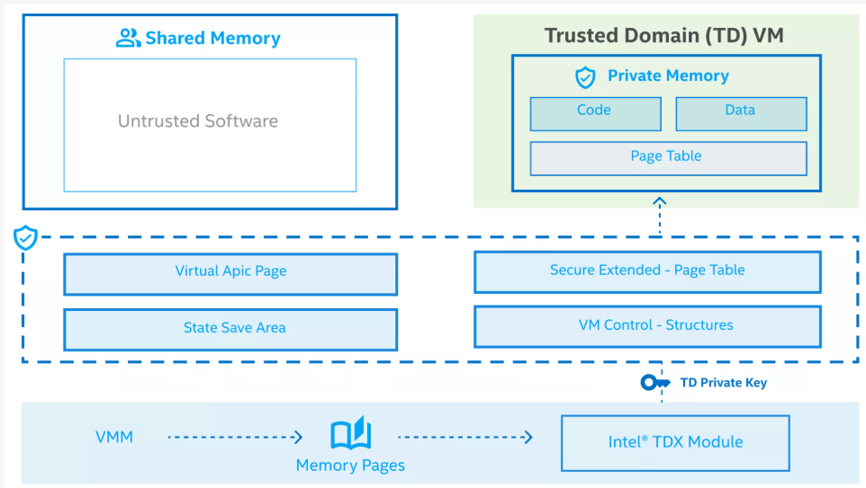
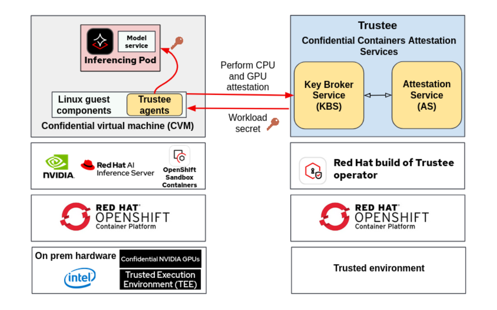
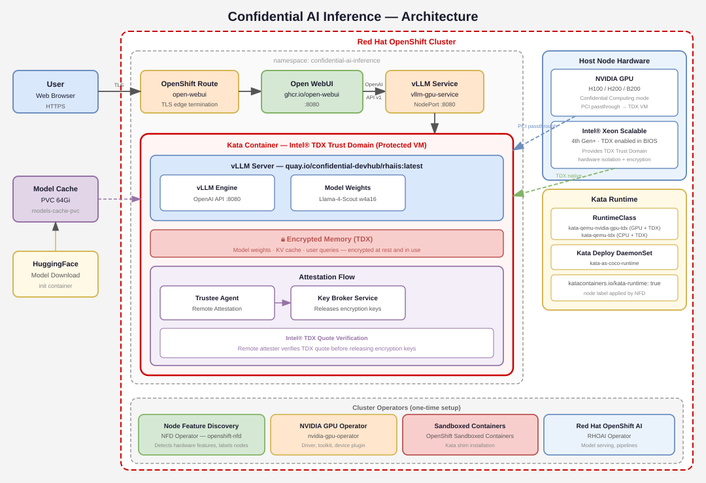

# Confidential Computing for AI Inference with Intel® TDX

Deploy confidential containers with Intel® Trust Domain Extensions (Intel® TDX) to protect models and sensitive data from unauthorized access.


## Table of contents

- [Detailed description](#detailed-description)
  - [Architecture diagrams](#architecture-diagrams)
- [Requirements](#requirements)
  - [Minimum hardware requirements](#minimum-hardware-requirements)
  - [BIOS Configuration](#bios-configuration)
  - [OS and GPU Passthrough Configuration](#os-and-gpu-passthrough-configuration)
  - [Minimum software requirements](#minimum-software-requirements)
  - [Additional](#additional)
- [Deploy](#deploy)
  - [Clone the repository](#clone-the-repository)
  - [Create the project](#create-the-project)
  - [Create the security permissions](#create-the-security-permissions)
  - [Build and deploy the helm chart](#build-and-deploy-the-helm-chart)
- [Test](#test)
- [Delete](#delete)


## Detailed description

When a model is run on a server, its proprietary weights, sensitive data and all queries received by the users reside in unencrypted system memory. This grants any privileged software or user, such as a cluster administrator, the ability to inspect—and potentially steal—the model and its queries during runtime. Exposing data while in use represents a severe breach of privacy, security, and intellectual property.

Intel® Trust Domain Extensions, or TDX, is Intel's newest hardware-based confidential computing technology. This hardware-based Trusted Execution Environment (TEE) facilitates the deployment of trust domains (TDs), which are hardware-isolated VMs designed to enhance the protection of sensitive data and applications from unauthorized access. The memory and register state associated with the TEE are encrypted with a key specific to the TEE and accessible only to the hardware.

Intel® TDX delivers greater confidence in data integrity, confidentiality and authenticity, which enables engineers and tech professionals to create and maintain more secure systems, establishing more trust in virtualized environments.

Confidential containers secure workloads with a seamless attestation and key release flow. The Confidential Containers runtime starts a confidential VM - a Trust Domain. Inside this secure environment, the Trustee Agents take care of performing remote attestation, reaching out to the remote attester (Trustee) to verify that the environment is trustworthy and equipped with the right software and hardware features. If the attestation passes, the same agent requests the encryption keys from the Key Broker Service — a gatekeeper that ensures only verified environments get access. Every read and write to memory is encrypted, ensuring data is never exposed, even on an untrusted host.


### Architecture diagrams


*Intel® TDX features trust domains to protect data and applications from unauthorized access.*


*Confidential Containers utilize attestation services to ensure the environment is trustworthy before granting access.*


*Kata Containers is a container runtime which allows running Intel TDX-protected VMs, isolating the vLLM engine and model from unauthorized access.*


## Requirements

### Minimum hardware requirements 

- 16+ vCPUs if running model with GPU, 64+ vCPUs if running model with CPU, 5th Gen Intel® Xeon® Scalable Processors or newer
- 64+ GiB RAM if running model with GPU, 80+ GiB RAM if running model with CPU

**Optional, depending on selected hardware platform**
- 1 NVIDIA H100 GPU with 80GiB RAM

### Minimum software requirements

- Red Hat OpenShift 4.21.9+
- Red Hat OpenShift AI 3.4+
- OpenShift CLI (`oc`) - [Download here](https://docs.openshift.com/container-platform/latest/cli_reference/openshift_cli/getting-started-cli.html)
- Helm CLI (`helm`) - [Download here](https://helm.sh/docs/intro/install/)

### TDX and Confidential Containers Setup

#### BIOS Configuration
Intel® TDX must be enabled in BIOS before deployment. Follow this [guide](https://cc-enabling.trustedservices.intel.com/intel-tdx-enabling-guide/04/hardware_setup/) to set the BIOS configurations depending on the CPU.

To support Intel remote attestation and provision required platform manifests, the `SGX Factory Reset` BIOS knob must be set to `Enabled`.

#### MachineConfig Setup

>**Note:** It is possible to apply both MachineConfigs for Intel® TDX and NVIDIA GPU before reboot. The MachineConfigPool for the target pool (`master`, `worker`, `kata-oc`) can be paused by setting `spec.paused` to `true`, apply the MachineConfigs, then set `spec.paused` back to `false`.

##### Create MachineConfig for Intel® TDX 
A `MachineConfig` object is needed to configure the required kernel parameters and modules on the cluster nodes. [Reference](https://docs.redhat.com/en/documentation/openshift_sandboxed_containers/1.12/html-single/deploying_confidential_containers_on_bare-metal_servers/index#creating-tdx-machineconfig_metal-cc)

Kernel boot parameters to be applied:
- `nohibernate` disables system hibernation, which is required because TDX memory encryption keys are tied to the running instance and cnanot be safely restored from a hibernation snapshot.
- `kvm_intel.tdx` enables TDX support in the KVM Intel kernel module.

By default, `role` is set to `master` because it assumes a single-node cluster is used. Change to `kata-oc` for a multi-node cluster. Then create the config map:
```bash
oc create -f helm/tdx-setup/tdx-machine-config.yaml
```

The node will automatically reboot.

##### Create MachineConfig for NVIDIA GPUs (GPU only)
If running with a GPU, a `MachineConfig` is also needed to enable the Input-Output Memory Management Unit (IOMMU) to support GPU passthrough. [Reference](https://docs.redhat.com/en/documentation/openshift_sandboxed_containers/1.12/html-single/deploying_confidential_containers_on_bare-metal_servers/index#create-gpu-machineconfig_metal-cc)

Kernel boot parameters to be applied:
- `intel_iommu` enables the IOMMU
- `iommu` configures the IOMMU for GPU passthrough

By default, `role` is set to `master` because it assumes a single-node cluster is used. Change to `worker` for a multi-node cluster. Then create the config map:
```bash
oc create -f helm/tdx-setup/gpu-machine-config.yaml
```

The node will automatically reboot.

##### Check MachineConfigs and Kernel Boot Parameters
Check the MachineConfig(s) `99-enable-intel-tdx` and `100-iommu-kernel-args` (GPU only) are present:
```bash
oc get machineconfig
```

Check updated kernel boot parameters are present:
```bash
cat /proc/cmdline
```
-`nohibernate`
-`kvm_intel_tdx=1`
-`intel_iommu=on` (GPU only)
-`iommu=pt` (GPU only)

Verify the TDX module is initialized:
```bash
sudo dmesg | grep -i tdx

# Look for the following output:
# virt/tdx: BIOS enabled
# ...
# virt/tdx: module initialized
```

#### Install OpenShift Operators

Install the following from **Ecosystem->Software Catalog** on the OpenShift console. This is a one-time setup.

##### 1. Node Feature Discovery (NFD) v4.21+
- Install **Node Feature Discovery Operator** into `openshift-nfd`
- Go to **NFD → Create NodeFeatureDiscovery → Accept defaults → Create**
- Verify:
```bash
oc get pods -n openshift-nfd
# Should show nfd-controller-manager, nfd-master, nfd-worker all Running
```
- Create a NodeFeatureRule:
```bash
oc create -f helm/tdx-setup/node-feature-rule.yaml
```
- For GPU, create an additional NodeFeatureRule:
```bash
oc create -f helm/tdx-setup/node-feature-rule-gpu.yaml
```
- This will trigger a reboot. Verify `tdx.intel.com/keys` and several `sgx.intel.com` labels are present:
```bash
oc describe node $(oc get nodes -o jsonpath='{.items[0].metadata.name}') | grep -A 20 "Allocatable"
```

##### 2. Intel Device Plugins Operator v0.35.0+
- Install **Intel Device Plugins Operator** into `openshift-operators`
- Go to **Intel Device Plugins Operators → Intel Software Guard Extensions Device Plugin → Create SgxDevicePlugin → Accept defaults → Create**

##### 3. NVIDIA GPU Operator v26.3.0+ (GPU only) 
- Install **NVIDIA GPU Operator** into `nvidia-gpu-operator`
- Create a custom ClusterPolicy to enable it with OpenShift Sandboxed Containers. Notable fields: `ccManager`, `kataSandboxDevicePlugin`, `sandboxWorkloads`.
```bash
oc create -f helm/tdx-setup/gpu-cluster-policy.yaml
```
- Wait 10-20 minutes for driver compilation, then verify:
```bash
oc get pods -n nvidia-gpu-operator
# Should show all pods Running: gpu-operator, cc-manager, kata-sandbox-device-plugin, sandbox-validator, vfio-manager
oc describe node $(oc get nodes -o jsonpath='{.items[0].metadata.name}') | grep -A 20 "Allocatable"
# Should show the passthrough gpu nvidia.com/pgpu: 1
```

##### 4. OpenShift Sandboxed Containers Operator v1.12.0+
This is required to run Kata Containers, which are used to run Intel TDX-protected VMs (Trusted Domains).

__Create Feature Gate__
Creating an `osc-feature-gates` config map will enable confidential containers. The deployment mode determines how the OpenShift Sandboxed Containers Operator installs and configures the Kata runtime. By default, use the Machine Config Operator (MCO).
```bash
oc create -f helm/tdx-setup/feature-gate.yaml
```

__Create KataConfig__
Creating the Kataconfig custom resource will install the `kata-cc` and `kata-cc-nvidia-gpu` (if NVIDIA GPU Operator was set up properly) runtime classes needed to run the workloads inside confidential containers. Note inside `tdx-kataconfig.yaml`, `checkNodeEligibility` must be set to `true` and the label `kata-cc` is set to `true`.
```bash
oc create -f helm/tdx-setup/tdx-kataconfig.yaml
```

This will trigger an automatic reboot, taking 10-60 minutes depending on deployment size, hardware type, and other factors. Monitor the status until the `InProgress` condition has status `False`:
```bash
watch "oc describe kataconfig | sed -n /^Status:/,/^Events/p"
```
Alternatively, on the OpenShift console, go to the OpenShift sandboxed containers Operator → KataConfig → `example-kataconfig`' and confirm `InProgress` is set to `False`.

Then verify the runtime classes `kata-cc` and `kata-cc-nvidia-gpu` (if using GPU) are present:
```bash
oc get runtimeclass
```

##### 5. Red Hat Build of Trustee v1.1.0+
This is required for TDX attestation for confidential containers.

##### 6. LVM Storage v4.19+
- Install a blank secondary disk. Wipe it clean and acquire the persistent path. Below is an example for a blank disk named *nvme0n1*.
  - Check for available disks: *lsblk*
  - Wipe the disk: *wipefs -a /dev/nvme0n1*
  - Check it is empty (FSTYPE should be blank): *lsblk -f /dev/nvme0n1*
  - Find persistent path: *ls -l /dev/disk/by-path/ | grep nvme0n1*
- Install **LVM Storage** into `openshift-storage`
- Go to **LVM Storage → Create LVMCluster → storage → deviceClasses → deviceSelector → paths**
- Add the path to the secondary disk i.e. /dev/disk/by-path/pci-xxxx:xx:xx.x-nvme-x.
- Press "Create".
- Go to StorageClass and update this disk to be the default class. All required PersistentVolumes and PersistentVolumeClaims will be based on this StorageClass. Note down the name of this StorageClass.


### Additional

- User permissions: standard user. No elevated cluster permissions required.
- Hugging Face token: [acquire a token](https://huggingface.co/settings/tokens)

#### Create initdata (optional)
To securely initialize a pod, initdata can be created. Follow these [instructions](https://docs.redhat.com/en/documentation/openshift_sandboxed_containers/1.12/html-single/deploying_confidential_containers_on_bare-metal_servers/index#create-initdata_metal-cc) to generate it, then replace the value of `io.katacontainers.config.hypervisor.cc_init_data` inside [deployment.yaml](./helm/templates/deployment.yaml).

Alternatively, simply use the provided initdata in the YAML file. 


## Deploy

This AI Quickstart will deploy one of two models depending on the hardware platform. vLLM is used for model serving but it is secured using confidential containers powered by Intel® TDX. 
- **For GPU:** [RedHatAI/Llama-4-Scout-17B-16E-Instruct-quantized.w4a16](https://huggingface.co/RedHatAI/Llama-4-Scout-17B-16E-Instruct-quantized.w4a16). This model was obtained by quantizing weights of [Llama-4-Scout-17B-16E-Instruct](https://huggingface.co/meta-llama/Llama-4-Scout-17B-16E-Instruct) to INT4, reducing memory and disk size requirements by approximately 75%.
- **For CPU:** [meta-llama/Llama-3.1-8B-Instruct](https://huggingface.co/meta-llama/Llama-3.1-8B-Instruct). This small model runs optimally on CPU.

### Clone the repository

```bash
git clone https://github.com/rh-ai-quickstart/confidential-ai-inference
cd confidential-ai-inference
```

### Create the project

```bash
PROJECT="confidential-ai-inference"
oc new-project ${PROJECT}
```

### Create the security permissions
```bash
export SA="vllm-sa"
oc create sa ${SA} -n ${PROJECT}
oc adm policy add-scc-to-user privileged -z ${SA} -n ${PROJECT}
```

### Build and deploy the helm chart

```bash
export DEVICE="gpu" # options: [gpu, cpu]
export HF_TOKEN="your-huggingface-token"
export STORAGE_CLASS_NAME="your-lvm-storageclass-name" # default: lvms-vg1
helm install ${PROJECT} helm/ --namespace ${PROJECT} --set device=${DEVICE} --set sa=${SA} --set hfToken=${HF_TOKEN} --set storageClassName=${STORAGE_CLASS_NAME}
```


## Test

The UI is exposed via an OpenShift Route with TLS. To get the URL, run this command:
```bash
oc get route open-webui -n $PROJECT
```

Open this URL in a web browser. Enter in prompts to generate responses from the model, while being protected by Intel® TDX.


## Delete

To uninstall and delete the project. The persistent volume claim for storing the models needs to be deleted separately.
```bash
helm uninstall $PROJECT
oc delete project $PROJECT
```
